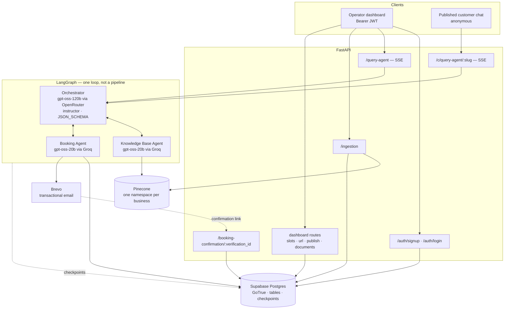
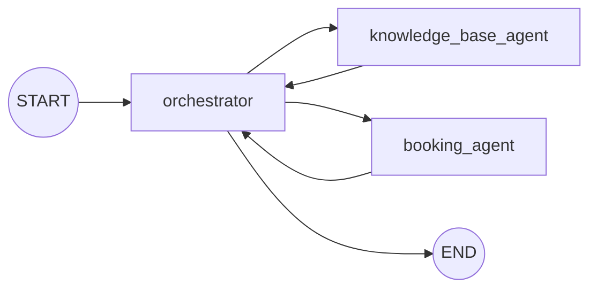

# Multi-Agent FrontDesk
A multi-agent backend that turns a business's documents and calendar into an **AI front
desk** its customers can talk to. The business signs up, uploads its PDFs, defines its
bookable slots, and shares one URL. Its customers open that URL and chat with an agent
that answers from those documents and books those slots — with an email confirmation
step before anything is held.

---

## 1. What is this?

A **FastAPI** service wrapping a **LangGraph** state machine. An **Orchestrator** agent
reads each turn and decides which specialists to call:

- **Knowledge Base Agent** — RAG over Pinecone, scoped to the business's own namespace.
- **Booking Agent** — assigns pre-created slots in Supabase and emails a confirmation link.

The orchestrator composes their answers into a single reply. Two audiences hit the same
graph through different doors:

| Audience | Door | Identity |
|---|---|---|
| The business (operator dashboard) | `POST /query-agent` | Supabase JWT, verified per request |
| Its customers (published chat) | `POST /c/query-agent/{slug}` | Anonymous; the business is resolved from the URL slug |

The product frontend is a **separate repo** —
[`operations-copilot-js`](https://striderr1o1.github.io/operations-copilot-js/) — deployed
to GitHub Pages. This repo is the backend, the agent graph, and the eval suite.

**Why it's interesting:** the routing layer is a loop rather than a pipeline, tenant
identity never enters an LLM prompt, and the orchestrator's routing decisions are held to
a 60-scenario regression suite instead of vibes.

---

## 2. Live demo / video

[](https://www.youtube.com/watch?v=WkthJS-O92c)

**▶ [Build vlog on YouTube](https://www.youtube.com/watch?v=WkthJS-O92c)** — walkthrough of
how the system was built and what it does.

---

## 3. Architecture diagram



### The graph itself

All three nodes route through **the same** conditional function, `tool_call_node`, so a
sub-agent can hand straight to another sub-agent without a return trip through the
orchestrator:



Every edge above is `tool_call_node` choosing one of four targets. It reads
`return_to_user_decision` first, then pops the next entry in `tool_calls`, then falls back
to `orchestrator`.

---

## 4. Key engineering decisions

### The graph is a loop, not a pipeline

Each of the three nodes gets an identical conditional edge map to
`{end, knowledge_base_agent, booking_agent, orchestrator}`
(`src/agents/graph.py:26-46`). A "book me a room, and what's the cancellation policy?" turn
can run booking → KB → orchestrator without paying for an extra orchestrator hop between
the two specialists.

Sub-agent nodes consume the queue **destructively** — they copy `tool_calls`, remove the
entry they served, and return the remainder — so the queue drains as the graph runs
(`src/agents/agent.py:56-76`).

**Termination has two independent brakes.** The orchestrator's own `return_to_user` flag,
and `count > 3` in `orchestrator()`, which forces the decision true no matter what the LLM
asked for. An LLM that never volunteers to stop still stops.

### Tenant identity never touches a prompt

`user_id` and the caller's Supabase client travel through LangChain's `RunnableConfig`, not
the message list. Tools read `config["configurable"]["user_id"]` and scope every query with
`.eq("business_id", user_id)`.

Three alternatives were rejected on the way there (`self_docs/29thjuly.md`): putting it in
`graph_state` (a whole extra dimension for one value), putting it in the LLM prompt
(*"the LLM can drop it, hallucinate it, or echo it back to the user"*), and per-request tool
classes (forces a fresh `create_agent()` per request). `RunnableConfig` already threads
through nodes → agent → tools for free.

### One Supabase client per request, built once

Originally every tool call built its own client. Now `dependencies.py` builds one
authenticated client per request and threads it through the same config channel
(`self_docs/6thaugust.md`). Two wins: all tool calls in a request share one client and one
`auth.uid()`, and the db functions became testable with a mock client because they take the
client as a parameter instead of constructing it.

### Booking confirms by email webhook, not a LangGraph interrupt

`langgraph.interrupt` was the obvious fit and was **rejected** (`self_docs/24thaug.md`): a
business has exactly one `thread_id`, so pausing the checkpoint mid-booking would collide as
soon as two customers book at once, and checkpoint memory isn't meant to be held open that
long.

Instead the booking tool writes `status = 'pending'` and emails a link built from the row's
`verification_id`. Clicking it hits `/booking-confirmation/{verification_id}`, which calls the
`confirm_verification` RPC. State lives in the row, not in a suspended graph.

### Structured output is provider-sensitive

The orchestrator uses `instructor` in `Mode.JSON_SCHEMA` over OpenRouter, and
`get_chat_completion` passes `extra_body={"provider": {"require_parameters": True}}`. That
flag makes OpenRouter route only to providers that actually honour the strict
`response_format`. Without it, requests can land on a provider that ignores it and returns
unconstrained prose — which fails parsing *intermittently* rather than loudly.

### Ingestion and retrieval must share an embedding model

Query and document vectors have to live in the same space, so
`KnowledgeBaseTool/embedding_config.py` is the single source for both paths. It carries three
implementations (OpenRouter, Google, Ollama); **OpenRouter is the one wired up**.

The model natively emits 2048 dimensions against a 1024-dim Pinecone index. It is trained
with Matryoshka Representation Learning, so truncating to the first 1024 values is valid —
and the code truncates explicitly rather than trusting the provider's `dimensions` hint,
which some providers ignore.

### Deleting a source: vectors first, row second

`/delete-ingested-source` deletes from Pinecone **before** dropping the `ingestions` row. If
Pinecone fails, the row survives with the vector ids still on record and the delete can be
retried. Dropping the row first would strand the vectors in the namespace with nothing left
pointing at them.

### Async all the way down

The Pinecone client is `AsyncPinecone`, opened per operation rather than held on the
instance — it's an async context manager, so it can't live in a sync `__init__`. Each index
client gets its own `async with`, because closing the parent client does **not** close the
index's connection pool. Upserts batch at 100, deletes at 1000 (Pinecone's delete-by-id cap).


---

## 5. Tech stack

| Component | Technology |
|---|---|
| Orchestration | LangGraph — `StateGraph`, conditional routing, Postgres checkpointer, `RetryPolicy(max_attempts=3)` per node |
| Orchestrator LLM | OpenRouter — `openai/gpt-oss-120b` via `instructor` (`Mode.JSON_SCHEMA`) |
| Sub-agent LLMs | Groq — `openai/gpt-oss-20b`, `temperature=0`, built with `create_agent` |
| Embeddings | OpenRouter — `nvidia/llama-nemotron-embed-vl-1b-v2:free` (2048 → 1024, Matryoshka truncation) |
| Vector store | Pinecone serverless — cosine, 1024-dim, one namespace per business |
| Database & auth | Supabase — Postgres + GoTrue |
| Checkpointing | `langgraph-checkpoint-postgres` — `AsyncPostgresSaver` |
| PDF pipeline | `PyPDFLoader` + `RecursiveCharacterTextSplitter` (1000 / 200 overlap) |
| Transactional email | Brevo REST API |
| Tracing | LangSmith (`wrap_openai` on the orchestrator client) |
| Web framework | FastAPI, SSE streaming |
| Deployment | Docker — `python:3.11-slim`, uvicorn from `src/`, binds `$PORT` |


---

## 6. Core workflows

### Chat (both doors)

```
validate caller  →  build per-request Supabase client  →  build KB + booking agents
bound to (user_id, client)  →  resolve the business's thread_id  →  compile the graph
against AsyncPostgresSaver  →  stream node updates as SSE
```

The stream emits four event types, so a UI can show routing as it happens:

| SSE `event` | Emitted when | Payload |
|---|---|---|
| `agent calls` | the orchestrator node returns | the `tool_calls` it queued |
| `knowledge base agent` | the KB node returns | that agent's answer |
| `booking agent` | the booking node returns | that agent's answer |
| `final response` | any update carries `return_to_user_decision` **and** a response | the reply |

`final response` is taken off whichever update carries it rather than off the last chunk in
the loop — the final chunk can come from a sub-agent node whose state delta has no
`response_to_user` at all (`src/dependencies.py:50-55`).

### Ingestion

`POST /ingestion` → resolve the caller's namespace from `pinecone_data_table` → write the
upload to a temp dir → load and chunk the PDF → embed in batches of 99 → upsert to Pinecone
in batches of 100 → write one `ingestions` row holding the filename, the
`pinecone_data_table` PK, and the full vector-id list as JSONB → delete the temp dir.

Vector ids are deterministic: `"{source}#chunk: {i}"`. The recorded `source_name` is the
uploaded filename, not the temp path it was copied to.

### Booking

1. The **business** creates empty slots from the dashboard (`/add-slot`) — `occupier_email`
   null, `status` pending.
2. A **customer** asks for a time. The booking agent calls `fetch_room_data` first, always,
   so it only ever offers slots that are actually open.
3. On agreement it calls `update_room_data(slot_id, occupier_email)`, which sets the
   occupier and emails a confirmation link. **The agent cannot create, delete, or reschedule
   slots** — those tools aren't bound to it, so a request for a time the business never
   opened cannot be satisfied, and the prompt tells it to say so rather than substitute the
   nearest slot.
4. The customer clicks the link → `/booking-confirmation/{verification_id}` →
   `confirm_verification` RPC → `status = 'confirmed'`.

An update that matches no row still returns HTTP 200 with an empty list, so
`update_room_data` raises on an empty result rather than silently "succeeding" and sending
no email.

### Publishing

Every signup gets a `links` row with a random 8-character slug (Postgres trigger,
`initialize_default_link`). `/set-publish` toggles `published`. `/c/query-agent/{slug}`
resolves the business from the slug and **refuses to run unless that flag is true**.

---

## 7. Security / multi-tenancy

### Session validation asks GoTrue, not the JWT

`check_session_exists` calls `supabase.auth.get_user(token)` instead of decoding the token
locally, so a revoked session or a deleted user is rejected **now** rather than staying
trusted until the token's own expiry. Raw passwords are forwarded to GoTrue and nowhere
else — never persisted, logged, or returned.

Because the dependency runs *before* the route body, its failures can't be caught by a
per-route `try/except`; an app-level handler maps `AuthenticationError` to the status
Supabase reported. GoTrue answers 400 for bad credentials, which `sign_in` rewrites to the
honest 401.

### Four Supabase clients, deliberately not interchangeable

| Accessor | Key | Used by |
|---|---|---|
| `get_supabase_client_with_token(jwt)` | service_role + `postgrest.auth(jwt)` | every authenticated request |
| `get_supabase_anon_client()` | anon | the two public endpoints |
| `create_auth_client()` | service_role | one throwaway client per auth call |
| `get_supabase_client()` | service_role | shared module-level client (now vestigial — see §11) |

`get_supabase_client_with_token` is what almost everything runs on. It overrides the
Authorization header with the caller's JWT, so PostgREST executes the request as
`authenticated` with `auth.uid()` resolving to that user, and RLS applies.

`create_auth_client()` exists because **supabase-py stores the signed-in session on the
client instance**. Calling `sign_in_with_password` on the shared client would leave every
later request in the process carrying that user's JWT instead of the project key — a
cross-request identity leak in a running server. `persist_session=False` does not prevent
this; the session still lands in memory. `auto_refresh_token=False` keeps discarded clients
from leaving refresh-timer threads behind.

### Two layers of tenant isolation, and they are not equally strong

**Layer 1 — application scoping (the one actually doing the work).** Every query filters on
`business_id`, including on paths where an id is already unique: `delete_slot_from_supabase`
matches `slotid` *and* `business_id`, so another business's slot can't be deleted by guessing
its uuid. `get_record_ids_from_supabase` does the same for `ing_id`. Tenant ids reach these
filters through `RunnableConfig`, never through an LLM prompt, so no amount of prompt
injection can change which rows a tool touches.

**Layer 2 — RLS.** Enabled, and genuinely tight on `ingestions`: select, insert and delete
are all `auth.uid() = business_id`. Elsewhere the recorded policies are permissive —
`slots_read`, `read_namespace_name`, `read_customers_data` and the anon read policies are all
`using (true)`. On those tables RLS is not a second line of defence; application scoping is
the only one.

worth stating plainly:

- **The published customer chat runs the whole graph on the anon client.** The booking agent
  therefore writes to `slots` as `anon`, scoped only by the `business_id` resolved from the
  URL slug. The recorded DDL grants anon `select` and `insert` on `slots` but no `update`;
  `src/utils/postgresql_code.sql` is an incomplete record (it says so), and the Supabase
  dashboard is the source of truth.

### Abuse surface on the public route

`/c/query-agent/{slug}` is anonymous by design — a business's customers have no account. It
is gated on `published`, and every query increments `customers_data.total_requests` for that
browser's client-side id, counted **before** the stream starts (a `StreamingResponse` returns
immediately and the generator runs after the handler is gone, so an increment placed after it
would never run). The counter is currently recorded but not enforced as a cap.

`increment_customer_requests_in_db` and `save_customer_chat` are read-modify-write, not
atomic — PostgREST can't express `total_requests = total_requests + 1`, so two concurrent
queries from the same customer can both read the same value and one update is lost. An RPC
doing it in SQL is the fix if that ever matters.

CORS is a hardcoded allowlist in `src/main.py`; new origins go in by hand.

---

## 8. Evaluation

**The eval layer is the regression suite.** There is no runnable pytest suite — `tests/` is
gitignored and holds manual scripts whose functions take arguments and are driven by
commented-out calls at the bottom of each file. Don't report "tests pass" from a pytest run
in this repo.

`evals/orchestrator_dataset.json` holds **60 hand-written scenarios** across five categories.
Each pins the exact graph state the orchestrator node would see and checks the single
decision it makes.

| Category | Scenarios | What it asserts |
|---|---|---|
| `initial_routing` | 20 | which agents get queued on a fresh turn |
| `after_booking_response` | 10 | return to the user, or queue more calls |
| `after_kb_response` | 10 | same, from the KB side |
| `empty_agent_response` | 10 | tool calls **and** the return decision together |
| `irrelevant` | 10 | returns to the user *with* a non-empty `response_to_user` |

Three decisions make this suite honest:

- **`expected.decisions` is a list of acceptable decisions, not one golden answer.** Routing
  is legitimately non-deterministic and several scenarios have more than one defensible next
  step. A scenario passes if the decision matches any entry. Agent names compare as sets, and
  the free-form `argument` string is never graded.
- **It tests the node, not the graph.** `evaluation_engine.py` builds a real
  `agentic_workflow` and calls `agent.orchestrator(state)` directly. Sub-agents, Pinecone and
  Supabase are never touched — the orchestrator node reads only `messages`,
  `booking_agent_output`, `knowledge_base_agent_output` and `count`, all pinned by the dataset.
- **A swallowed exception is never a pass.** See §4.

`empty_agent_response` asserts the *pairing* of tool calls and return decision, because the
failure it exists to catch is a wrong combination — retrying while claiming to return, or
stalling with nothing queued. `irrelevant` ignores tool calls (production routing ignores
them too once `return_to_user_decision` is true) and instead requires a non-empty reply,
since there the orchestrator's own answer is everything the user gets.

### Running it

Each scenario is one LLM call, so a 20-scenario category takes a couple of minutes. **The
HTTP routes in `src/routes/eval.py` are entirely commented out** — the router registers no
paths — so call the graders directly:

```bash
PYTHONPATH=src python -c "
from evals.evaluation_engine import load_scenarios, run_initial_routing
user = {'id': '<uuid>', 'access_token': '<jwt>'}
status, results = run_initial_routing(load_scenarios('initial_routing'), user)
print(sum(status), '/', len(status))
"
```

Swap in `run_after_booking_response`, `run_after_kb_response`, `run_empty_agent_response` or
`run_irrelevant` with the matching category name. `evaluation_engine.py` bootstraps its own
imports (inserts `src/` on `sys.path`, loads `.env` from the repo root) because it lives
outside `src/`, and importing it builds the LLM clients as a side effect — the API keys have
to be present.

`build_report` in `routes/eval.py` folds all five graders into one report shape so a
frontend can render them identically, and is still used if those routes are uncommented.

---

## 9. API

| Endpoint | Auth | Purpose |
|---|---|---|
| `POST /auth/signup` | public | Register. Email confirmation is on, so this returns `requires_email_confirmation: true` and a null session |
| `POST /auth/login` | public | Returns `{user, session}` with the JWT |
| `POST /query-agent` | Bearer | Operator chat — SSE stream |
| `POST /ingestion` | Bearer | Upload a PDF → chunk → embed → the caller's own Pinecone namespace |
| `GET /get-url` | Bearer | The business's share slug + current publish status |
| `POST /set-publish` | Bearer | Toggle `links.published` |
| `GET /get-slots-data` | Bearer | List the business's slots |
| `POST /add-slot` | Bearer | Create an empty slot from `time_start` / `time_end` |
| `POST /delete-slot` | Bearer | Delete a slot by `slot_id` |
| `GET /get-record-count` | Bearer | List ingested documents as `{ingestion_id, source_name}` |
| `POST /delete-ingested-source` | Bearer | Delete one source's vectors, then its `ingestions` row |
| `POST /c/query-agent/{url_string}` | public | Published customer chat — SSE; 500s unless the business has published |
| `GET /booking-confirmation/{verification_id}` | public | Email webhook → `confirm_verification` RPC |

Interactive docs at `/docs` once the server is up.

Notes:

- `/query-agent` and `/c/query-agent/{slug}` both take `{query, unique_id}`. `unique_id`
  is the browser's client-side id and is only *used* on the public route — the dashboard
  owner has no `customers_data` row, so there is nowhere to save the transcript and the save
  is skipped rather than raising.
- There is **no `POST /query`**. The synchronous endpoint was dropped during the async
  migration; streaming is the only inference path.
- Every `/eval/*` route is commented out. The router is still registered in `main.py` and
  contributes no paths.

---

## 10. Local setup

```bash
pip install -r requirements.txt

# API — must run from src/, see "Import layout" below
cd src && uvicorn main:app --reload        # http://localhost:8000, docs at /docs

# Anything invoked from the repo root needs the path set explicitly
PYTHONPATH=src python -c "from main import app"

# Docker — runs uvicorn from src/ and binds $PORT (default 3000)
docker build -t ops-copilot . && docker run -p 8000:3000 --env-file .env ops-copilot
```

### Environment

`.env` at the repo root:

| Variable | Purpose |
|---|---|
| `OPENROUTER_API_KEY` | Orchestrator LLM **and** embeddings |
| `GROQ_API_KEY` | Sub-agent LLMs |
| `PINECONE_API_KEY`, `PINECONE_INDEX_NAME`, `INDEX_URL_PINECONE` | Vector store. The index host is used directly for data-plane calls |
| `SUPABASE_URL`, `SUPABASE_KEY`, `SUPABASE_ANON_KEY` | `SUPABASE_KEY` is the **service_role** key |
| `DATABASE_URL` | Postgres connection string for the LangGraph checkpointer |
| `BREVO_API_KEY`, `BREVO_SENDER_EMAIL`, `BREVO_SENDER_NAME` | Booking confirmation email |
| `RAILWAY_PUBLIC_DOMAIN` | Sets the base URL in confirmation links; falls back to `http://localhost:8000` |
| `GOOGLE_API_KEY` | Only if you switch to the Google embedding implementation |
| `LANGSMITH_*` | Optional tracing |

### Import layout

Modules import each other as `from agents...`, `from services...`, `from routes...` —
**not** `src.agents...`. So `src/` must be on the path: run from inside `src/`, or set
`PYTHONPATH=src`. The `PYTHONPATH=src` line inside `.env` is read by `python-dotenv` at
runtime and does **not** affect module resolution for the interpreter that is already
starting up — it is not a substitute for either method above.

### Frontend

Static-served frontend from the [separate repo](https://github.com/striderr1o1/operations-copilot-js).
`src/main.py` allow-lists `localhost:5173`, `localhost:3000`, `127.0.0.1` on both, `null`, and
`https://striderr1o1.github.io`. Append `?api=http://127.0.0.1:8000` to point a deployed page
at a local server.

---

## 11. Technical deep dive

### Graph state

```python
class graph_state(TypedDict):
    messages: Annotated[list, operator.add]   # reducer: appends, never replaces
    tool_calls: list                          # queue; sub-agents drain it destructively
    knowledge_base_agent_output: str
    booking_agent_output: str
    return_to_user_decision: bool
    response_to_user: str
    count: int                                # hop counter; count > 3 forces termination
```

`messages` is the only reduced channel. Every other key is last-write-wins, which is why the
orchestrator's error branch — returning a dict with *no* `tool_calls` key — leaves the
previous queue untouched rather than clearing it.

The orchestrator writes its own reasoning back into `messages` as an assistant turn, so the
next hop sees why the last routing decision was made. Sub-agent outputs are additionally
appended to the prompt as a synthetic assistant message in `get_chat_completion`, separate
from the conversation itself.

### Checkpointing and the thread model

`setup_graph` returns an **uncompiled** builder. `dependencies.py` compiles it per request
against `AsyncPostgresSaver.from_conn_string(DATABASE_URL)`, keyed on the business's
`links.thread_id`. `checkpointer.setup()` runs on every request, creating the
`checkpoints`, `checkpoint_blobs`, `checkpoint_writes` and `checkpoint_migrations` tables on
first use.

**A known consequence:** the thread id is resolved from the *business's* `links` row, and the
public route calls the same function with `user = {"id": business_id}`. So every customer of
a business shares one LangGraph thread. This is the same constraint that ruled out
`langgraph.interrupt` for booking confirmation (§4). Per-customer threads would need
`customers_data.customer_client_side_id` folded into the thread key.

### Database schema

Nine tables in `public`. Four are LangGraph's (`checkpoints`, `checkpoint_blobs`,
`checkpoint_writes`, `checkpoint_migrations`); the application owns five:

**`slots`** — bookable time, created empty by the business.

| Column | Type | Notes |
|---|---|---|
| `slotid` | uuid PK | default `gen_random_uuid()` |
| `business_id` | uuid → `auth.users` | every query scoped by it |
| `time_start`, `time_end` | timestamptz | set by the business; the agent cannot change them |
| `occupier_email` | citext | null = open |
| `status` | text | check constraint: `pending` \| `confirmed` |
| `verification_id` | uuid | default `gen_random_uuid()`; the token in the confirmation link |

**`pinecone_data_table`** — maps a business to its Pinecone namespace. Populated by the
`initialize_pinecone_data` trigger on `auth.users` insert, with `namespace_name = NEW.email`.
Its `pc_id` PK is what `ingestions.pc_id` references.

**`ingestions`** — one row per ingested document: `ing_id` PK, `source_name`, `pc_id` FK,
`business_id` FK, and `record_ids_json` holding `{"vector_ids_list": [...]}`. The reader also
accepts a bare list, so rows written before that wrapper still delete cleanly.

**`links`** — `link_id` PK, `url` (the 8-char slug), `thread_id` uuid, `business_id` FK,
`published` bool default true. Both this row and the `pinecone_data_table` row are created by
triggers at signup.

**`customers_data`** — `customer_id`, `customer_client_side_id` (**globally unique**, not
unique per business), `business_id` FK, `total_requests`, `messages` jsonb. Ownership checks
match `business_id` as well as the client-side id, so one business can't touch another's
customer row.

DDL, grants and policies are kept in `src/utils/postgresql_code.sql` as a partial record —
it is explicitly incomplete, `supabase/` is gitignored, and the dashboard is the source of
truth. One PostgREST gotcha documented there: `Prefer: return=representation` means an insert
or delete needs **SELECT** privilege too, and a missing grant surfaces as `42501 permission
denied`, which is a different failure from an RLS rejection.

### Error taxonomy

`IngestionError`, `RetrievalError`, `AuthenticationError` (carries the status code Supabase
reported), `BadRequestError`. Tools raise `ToolException` so LangChain can surface a failure
back to the calling agent rather than killing the graph. `exception_handlers.py` is kept
separate from `exceptions.py` so the exception module stays framework-free.

### Known rough edges

Honest inventory of things a reader will otherwise trip over:

- **`evals/routing_dataset.json`** (50 examples, `copilot-routing-v1`) is not loaded by
  anything. `evaluation_engine.py` reads only `orchestrator_dataset.json`.
- **`evaluation_engine._get_agent` calls the now-async `get_supabase_client_with_token`
  without awaiting it**, so the client is a coroutine object. Harmless today because the
  orchestrator-only graders never touch a sub-agent or the DB — but it will bite anyone who
  extends the evals to exercise the full graph.
- **`graph.get_checkpointer()` is dead**, and `InMemorySaver` is imported but unused. The
  live checkpointer is built in `dependencies.py`.
- **`get_supabase_client()`** — the shared service_role client — is imported but no longer
  called by anything; every db function takes its client as a parameter.
- **`delete_room_data` and `insert_room_data`** exist in `booking_tools.py` but are not bound
  to the booking agent. `delete_room_data` is a stub whose body is entirely commented out.
  Only `fetch_room_data` and `update_room_data` are live tools.
- **`self_docs/may24.md` describes a `clinics` / `appointments` skeleton that was never
  built.** The `self_docs/<date>.md` files are a working task list and record intent as much
  as fact — verify against the code before relying on any of it.
